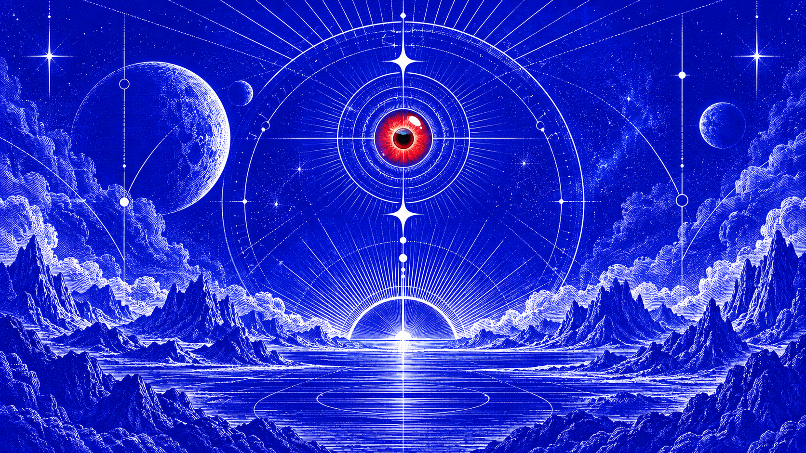
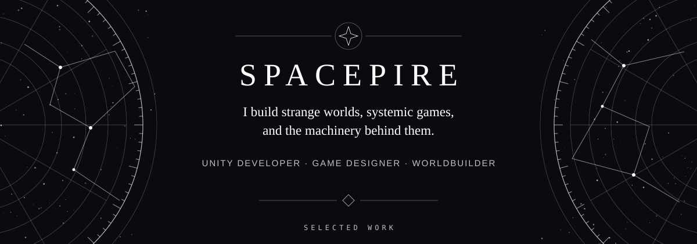

  

  

<table>
  <tr>
    <td width="50%" valign="top">
      <h3>PROJECT IDLE</h3>
      
A space-themed idle combat game built around progression, skill trees, super abilities, and persistent save systems.

      
Unity · C# · Gameplay Systems · UI Toolkit

    </td>
    <td width="50%" valign="top">
      <h3><a href="https://github.com/Pixel-Phantom-Studio/Project-Chaos">PROJECT CHAOS</a></h3>
      
An atmospheric horror game where light is both a guide and a weapon against the chaos hiding in the dark.

      
Unity · C# · Horror · Lighting &amp; Post-Processing

    </td>
  </tr>
</table>

  <a href="https://linkedin.com/in/%C3%B6mer-faruk-da%C5%9Fdemir-87066a32a">LinkedIn</a>
  &nbsp;·&nbsp;
  <a href="mailto:omerfarukdasdemir0000@gmail.com">Email</a>

